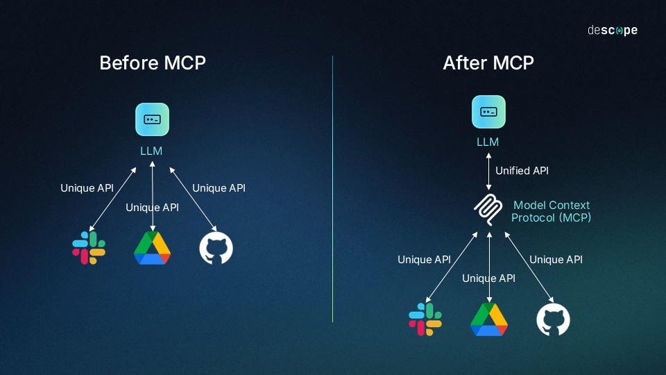
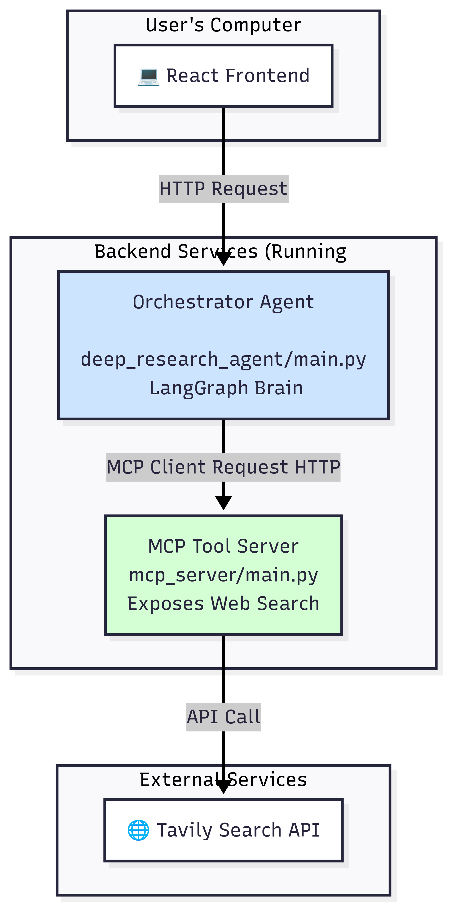
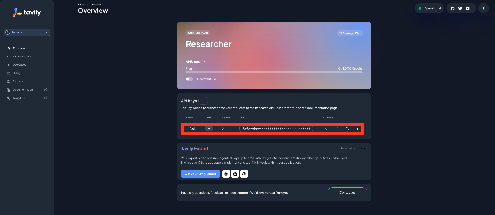

# ME344 Project X - Building your first AI Agent

Author: [Sujeeth Jinesh](https://www.linkedin.com/in/SujeethJinesh/)

## 🚀 Quick Start

```bash
# Clone the repository
git clone <your-repo-url>
cd summer_2025

# Set up Python environment
python3 -m venv .venv
source .venv/bin/activate  # On Windows: .venv\Scripts\activate
pip install -r requirements.txt

# Install Ollama and pull models
curl -fsSL https://ollama.com/install.sh | sh
ollama pull llama3.1
ollama pull nomic-embed-text

# Start the RAG system (Part 1)
./run_part1.sh

# Or start the Deep Research Agent (Part 2)
./run_part2.sh
```

## Project Overview

This project teaches you to build two complementary AI systems:

### Part 1 - LLM + RAG Slang Translator

Build a Retrieval Augmented Generation (RAG) chatbot using local data to enhance your Large Language Model responses. Perfect for querying known, static datasets.

**Key Features:**
- Local vector database (ChromaDB) with 600k+ slang definitions
- React-based chat interface
- Jupyter notebook for data pipeline setup
- Real-time embedding and retrieval

### Part 2 - Deep Research Agent with MCP

Build an advanced research system that can search the web, learn from new information, and provide cited answers using LangGraph workflows and the Model Context Protocol (MCP).

**Key Features:**
- Multi-step research workflow with LangGraph
- Web search capabilities via Tavily API
- Dynamic knowledge base updates
- Citation tracking and source management

## 📁 Project Structure

```
summer_2025/
├── .venv/                      # Python virtual environment
├── chroma/                     # ChromaDB data directory
├── data/                       # Data files
│   └── cleaned_slang_data.csv  # Urban Dictionary slang dataset
├── deep_research_agent/        # Part 2: LangGraph research agent
│   ├── main.py                # FastAPI server for research agent
│   └── requirements.txt       # Agent-specific dependencies
├── llm-rag-chat/              # React frontend application
│   ├── src/
│   │   ├── components/        # React components
│   │   │   ├── Rag.js        # RAG implementation with embeddings
│   │   │   └── ...          # Other UI components
│   │   └── App.js           # Main application
│   ├── package.json         # Node.js dependencies
│   └── craco.config.js     # Webpack configuration
├── mcp_server/               # Part 2: MCP server for web search
│   └── main.py             # FastMCP server implementation
├── tests/                   # Test files
│   ├── python/             # Python test scripts
│   └── frontend/           # Frontend test files
├── images/                 # Documentation images
├── rag.ipynb              # Jupyter notebook for RAG setup
├── requirements.txt       # Python dependencies
├── run_part1.sh          # Start script for Part 1
├── run_part2.sh          # Start script for Part 2
├── CLAUDE.md             # AI assistant instructions
└── README.md             # This file
```

## 🔧 Dependencies

### Python Requirements
- **LangChain** (0.3.3): Document processing and embeddings
- **ChromaDB** (0.4.24): Vector database for similarity search
- **LangGraph** (0.2.45): Workflow orchestration for research agent
- **FastAPI** (0.115.4): Web framework for API endpoints
- **Ollama**: Local LLM inference (installed separately)
- **Jupyter**: Interactive notebook environment

### Frontend Requirements
- **React** (18.3.1): UI framework
- **ChromaDB JS Client** (1.7.3): Vector database client
- **Node.js** (14+): JavaScript runtime

---

## Part 1 - LLM + RAG Slang Translator

This project will teach you how to build a Retrieval Augmented Generation (RAG) chatbot. It can be used with text based data to enhance your Large Language Model (LLM). This technique is commonly referred to as LLM + RAG. This tutorial is heavily inspired by content from [pixegami](https://www.youtube.com/watch?v=2TJxpyO3ei4).

## Technical details of LLM + RAG

### What problem does RAG solve?

Standard LLMs do not have access to any outside data when generating responses to users, which is quite problematic when we want to augment our LLM to work with new information (e.g. breaking news, newly updated weather information).

One possible way to add this data is to continuously finetune our LLM (e.g. [LoRA](https://arxiv.org/abs/2106.09685)), but this is incredibly expensive, difficult, and may require downtime for an application. Often times, it may also not even be necessary as there's still a chance of hallucination.

RAG is designed with this in mind - being fast to add information without downtime, easy to deploy, and does not require significant compute.

### How does RAG work conceptually?

Think of a student as an LLM. That student will take an exam--think of the exam questions as a user's queries. The student is also allowed to build a cheatsheet before the exam.

When the student takes the exam (i.e. answers a query), they will look to their prewritten cheatsheet, and add in relevant information, potentially citing information.

Consider an example question of "What is the weather like today at Stanford?".

The student can "augment" the question by adding in information from their cheatsheet and transform it into something like "CONTEXT: Stanford weather - 75F high, 55F low. | QUESTION: What's the weather like today at Stanford?". This makes it much easier to answer the question.

The mechanics are slightly different for LLMs, but the concept is the same.

<div style="text-align: center;">
    
</div>

### How do we build an LLM + RAG System?

#### Setting up the Vector Database

1. Gather data. We will use weather data as an example, but our project will involve different data. Here's what that could look like, a table of weather data for selected regions, but it could be any text form data--even the whole Harry Potter book series!

<div style="text-align: center;">
    
</div>

2. Chunk and embed the data. This step can be thought of as splitting the data we have into smaller chunks so we can store smaller snippets of data into our database.

We "embed" the data by turning it into a vector that can be easily stored into our database. For technical people, this can be considered complimentary to hashing an object. This is typically done with another ML model that is specifically designed for embeddings!

<div style="text-align: center;">
    
</div>

3. Store the chunked and embedded data into our vector database. We can see that after we store the data in the database, it will be easy for us to look it up!

<div style="text-align: center;">
    
</div>

#### Augmenting the user's query for the model

1. Lookup relevant context for the user's query. Let's assume that the user is asking about the weather at Stanford. We can do this by passing the user's whole query to the embedding model and then to the vector database. This lookup should return us data that is relevant to our user's query by looking for similar data around it. In this case our embedding model would pick things related to "weather" and "Stanford", giving us back the relevant chunk for Stanford's weather.

<div style="text-align: center;">
    
</div>

2. Finally, we can augment our query using any format we'd like and directly pass this off to our LLM! The result will be a far more accurate answer to our question.

<div style="text-align: center;">
    
</div>

In summary, RAG enhances our LLM by passing the user's query to the vector database, returning potentially relevant information, and then "augmenting" our user's query to cite this relevant information.

The vector database is key here, because when our system performs lookups, we are embedding the question in a vector space and looking for similar values near it. These similar values are then used to augment our prompt like the example above: "CONTEXT: Stanford - 75F high, 55F low | QUERY : What is the weather like today at Stanford?" (note, we can add as many entries as fits within our LLM's context length).

Our vector database is filled up with files or documents we give it. This is done by first chunking the data (making smaller chunks of the data) and then creating embeddings for it (vector representations) to place it in the database. The database can be updated anytime and independently of the LLM (for our purposes).

Simple right? Let's dive into the project!

## Project Overview

In this project, you will build a slang translator using Llama 3.1 and RAG. We will be using [this dataset](https://www.kaggle.com/datasets/therohk/urban-dictionary-words-dataset?resource=download) as our slang data.

We encourage you to use any model and data of your choice! [Ollama](https://ollama.com/library) is a great and easy place to try out various models, and [Kaggle](https://www.kaggle.com/datasets) is a great place to look for datasets.

---

## 📋 Setup

If you prefer manual setup or encounter issues:

### Prerequisites

#### Enabling Internet on your GPU cluster

Reach out to Professor Jones to enable internet on your cluster, otherwise you will not be able to download models or any custom data you may want to use.

#### Accessing your cluster

SSH into your assigned cluster as root. It's important to be a root user because we will need to install Ollama, which requires root access.

## Download requirements

### Download Ollama

[Ollama](https://ollama.com/download/linux) is our model manager, and will make development using specific models significantly easier, make sure you are running as root (`root@hpcc-cluster-[C].stanford.edu`), and then execute the following command to download Ollama.

```
curl -fsSL https://ollama.com/install.sh | sh
```

Now switch back to the student user by running `su - student`. The rest of these commands will be run as the `student` user.

### Create a virtual environment

While running as the `student` user, you will want to create a virtual environment to manage dependencies.

If you have not already created a virtual environment before, paste the following into your terminal. This will create a python3.11 virtual environment called ".venv", and will activate the virtual environment.

```
# Create a folder for your python environment
mkdir -p ~/codes/python && cd ~/codes/python

# Create the actual python environment & call it ".venv"
python3.11 -m venv .venv

# Activate your python environment right now.
source .venv/bin/activate
```

<details>
  <summary>Why use a virtual environment?</summary>
  
  Virtual environments in Python primarily allow us to resolve dependencies in a controlled environment that are separate from system wide packages. Imagine some packages needing some specific package versions, while others need some others, this could lead to messy problems if you don't resolve dependencies in an isolated environment.
</details>

You can also add `source .venv/bin/activate` to your `.bashrc` so you'll activate the virtual environment on login (this is highly recommended).

<details>
  <summary>Why use bashrc?</summary>
  
  This script is run at the beginning of login, and allows us to define some actions we want to take before we get control of the terminal. In this case, we want to activate our python environment so we don't forget to do this later and mess with system packages accidentally.
</details>

Next, we need to run our Ollama locally. This will download the 8B model.

```
ollama run llama3.1
```

**Note**: You can easily swap out the model you are running here if you'd like a more powerful model. However, we assume you will be using this for the rest of the project. If you wish to use your own model. You'll want to replace all instances of `llama3.1` in the codebase to the model name you'll want to use.

<details>
  <summary>If you want to experiment with larger models, you'll want to learn a bit about <a href="https://huggingface.co/docs/optimum/en/concept_guides/quantization">quantization</a>!</summary>
For example You may even want to try the 70B model if your GPU has ~40GB of VRAM because it uses 4 bit quantization (basically reducing VRAM needed to run on a GPU). The P100s on your cluster have 16 GB of VRAM. All Llama 3.1 models were originally quantized with fp16, and if we use 4 bit quantization then we can expect to save ~75% (4/16 = 25% memory footprint) or use about 10GB of our P100 card.

```
ollama run llama3.1:70b
```

</details>

You may notice that Ollama doesn't detect any GPUs, and that's fine. We'll fix that later. This is because you are only on a CPU node right now and haven't deployed any GPU nodes.

After the model is downloaded, you'll get a prompt to start interacting with the model. Go ahead and play around with with it. Whenever you want to exit the chat, you can type `/bye` to end the conversation.

Ollama will also be running on `localhost:11434` in the background, this is an important detail for later as this is the url we'll use to interact with the model afterwards with our own user interface.

### Downloading Embedding Model

We'll be using a special embedding model for our vector database. In order for us to get that model we need to pull it from ollama. Run the command `ollama pull nomic-embed-text`.

### Starting our Vector Database

We'll want to create our vector database and have it run locally so we can store our documents there.

In order to allow for requests from our other chat interfaces, we'll allow Cross Origin Resource requests from our soon to be web server. We can do this by running:

`export CHROMA_SERVER_CORS_ALLOW_ORIGINS='["http://localhost:3000"]'`

Then we can start our vector database. Start it in a new terminal with `chroma run --host localhost --port 8000 --path ./chroma`

## Implementing RAG

### Creating a SLURM script

Use `pip` to install the package named `notebook`.

You'll want to clone the directory for this project for convenience (TODO: Make the repository called project-5).

Change to the `project-5` directory.

You should also install all the requirements for the rest of the project using pip. You can do this by doing `pip install -r requirements.txt`. This will install all the required modules you'll need.

Create a Slurm script to launch Jupyter Notebook on `compute-1-1`. Make sure you are in the `$HOME/project-5` directory (command to execute is pwd). Name the script `jupyter_submit.slurm`:

```
#!/bin/bash
#SBATCH --job-name="Jupyter"                # Job name
#SBATCH --mail-user=<email>@stanford.edu    # Email address
#SBATCH --mail-type=NONE                    # Mail notification type (NONE, BEGIN, END, FAIL, ALL)
#SBATCH --partition=gpu-pascal              # Node partition, use gpu-pascal for Nvidia Pascal architecture gpus
#SBATCH --nodes=1                           # Number of nodes requested
#SBATCH --ntasks=1                          # Number of processes
#SBATCH --time=03:00:00                     # Time limit request

source ~/codes/python/.venv/bin/activate
EXEC_DIR=$HOME/project-5
hostname && jupyter-notebook --no-browser --notebook-dir=$EXEC_DIR
```

Launch the job with `sbatch jupyter_submit.slurm`. Note you may need to cancel any other pending jobs with `scancel <job-id>`.

This will produce a slurm-<job-id>.out. Then you can run the following command in a separate window:

`ssh -L 8888:localhost:8888 student@hpcc-cluster-[C] -t ssh -L 8888:localhost:8888 compute-1-1`.

Then you can find the port forwarded address of the jupyter notebook with `egrep -w 'compute|localhost'  slurm-*.out`.

The output will look something like this:

```
...
slurm-103.out:compute-1-1
slurm-103.out:[I 18:40:29.846 NotebookApp] http://localhost:8888/?token=c11be5afa5cddd73548d8ff73786291202a37868d5c18451
slurm-103.out:        http://localhost:8888/?token=c11be5afa5cddd73548d8ff73786291202a37868d5c18451
```

Now you should be able to connect with the cluster and run jobs by following the link. In this case it's `http://localhost:8888/?token=c11be5afa5cddd73548d8ff73786291202a37868d5c18451` but it will depend on your output from the command.

From here you can open up the notebook named `rag.ipynb` and run through the cells.

Come back when you finished setting up your RAG pipeline!

## Testing Your RAG System

### Using the Automated Script (Recommended)

```bash
# Start the complete RAG system
./run_part1.sh

# Or start just the frontend (if you've already run the notebook)
./run_part1.sh --frontend-only
```

The script automatically handles all service startup and provides URLs when ready.

### Manual Testing

If you used the manual setup, now that we've updated our vector database, we want our model to use that when asked for queries. To do this, we will make a request to our vector database when the user gives us a query, append that information we received from the database, and then send that whole prompt off to the model!

We have provided an easy to interact with frontend so we can test out our model.

cd into `llm-rag-chat`

To start the development server, run `npm install` and then run `npm start` this will create your dev site on `localhost:3000`.

#### Port Forwarding (Remote Servers)

If running on a remote server, you'll need to set up port forwarding:

```bash
# Single command for all required ports
ssh -L 3000:localhost:3000 -L 8000:localhost:8000 -L 8888:localhost:8888 -L 11434:localhost:11434 student@hpcc-cluster-[C].stanford.edu
```

**Individual port explanations:**

- `3000` - React Frontend
- `8000` - ChromaDB Vector Database
- `8888` - Jupyter Notebook
- `11434` - Ollama LLM Server

If you navigate to `localhost:3000` on your computer, you'll see the chat interface!

Try playing around with the chat interface. This chat interface is connected to your backend model and uses the data we stored in our vector database!

## System Prompt Engineering

Read through the code in `llm-rag-chat/components/Rag.js`, there's a point at which we augment the user's query and tell the LLM to use the context to answer the question. You can instruct the model to behave in some way by adjusting this prompt, e.g. asking it to be more factual with the context, or do anything you want! For us we may want it to translate or answer questions! Feel free to adjust it to your use case!

## Look at metrics

You'll be able to use `htop` in your cluster to see how demanding the usage is whenever you submit a query to your model, you should see high GPU usage from your python program. This indicates that you're using your GPU!

We encourage you to try out various different models, parameter sizes, data, and system prompts to see how this effects the GPU usage, accuracy, speed, etc!

## Part 2 - Creating a Deep Research with LangGraph

In Part 1, we built a Slang Translator using a local RAG pipeline. This is powerful for querying a known, static dataset. But what if we want our application to answer questions about topics it has never seen before, using the most current information from the internet?

For this, we will upgrade our application to include a Deep Research Mode, similar to [OpenAI](https://openai.com/index/introducing-deep-research/) or [Gemini](https://gemini.google/overview/deep-research/?hl=en). This mode uses an agentic workflow -- instead of a single lookup, the LLM will follow a multi-step process to actively research topics, learn from what it finds, and provide cited answers.

### What is the Model Context Protocol (MCP)?

MCP is an open standard developed by Anthropic to standardize how AI models connect with external tools and data sources. This means that the LLM only needs to talk through one standard API rather than developing custom APIs like how we did for our RAG implementation.

<div style="text-align: center;">
    
</div>
Source: https://www.descope.com/learn/post/mcp

### How we will use MCP

The core principle of MCP is to decouple the agent's reasoning from the tools it uses. To do this, we will run two separate backend services:

1. The Orchestrator Agent (deep_research_agent): This is our LangGraph agent. It manages the high-level research plan and acts as the MCP Client.

2. The MCP Tool Server (mcp_server): This is a new service. Its only job is to host the Tavily web search tool and expose it over the network. It acts as the MCP Server.

This client-server model is how modern, scalable AI applications are built.

<div style="text-align: center;">
    
</div>

### Getting Started (Skip if done in Part 1)

Make sure your python environment is activated from Part 1.

```
source .venv/bin/activate
```

Make sure you've installed the requirements.txt

```
pip install -r requirements.txt
```

### Get a Free Web Search API Key

Our agent needs a tool to search the internet. We will use the Tavily API, which is designed for AI agents and offers a generous free tier.

1. Go to https://app.tavily.com/home and sign up for a free account.

<div style="text-align: center;">
    
</div>

2. After signing up, navigate to your dashboard and copy your API Key.

<div style="text-align: center;">
    
</div>

3. We need to make this key available to our application. The best way is to set it as an environment variable. Add the following line to your ~/.bashrc file. This ensures the key is loaded every time you log in.

```
# This command appends the export line to your .bashrc file
echo "export TAVILY_API_KEY='YOUR_KEY_HERE'" >> ~/.bashrc
```

4. Now, load the updated .bashrc file into your current terminal session so the key becomes active immediately.

```
# Load the new variable into your current session
source ~/.bashrc
```

### Running the Deep Research Agent

#### Using the Automated Script (Recommended)

```bash
# First, set up your Tavily API key
export TAVILY_API_KEY='your_api_key_here'

# Make script executable and run
chmod +x run_part2.sh
./run_part2.sh
```

The script will:

- ✅ Validate all requirements and dependencies
- 🚀 Start all services in the correct order
- 🔗 Provide service URLs and next steps
- ⚠️ Show clear error messages if anything fails

#### Port Forwarding (Remote Servers)

If running on a remote server, use this single command for all required ports:

```bash
# Replace [C] with your cluster number
ssh -L 3000:localhost:3000 -L 8000:localhost:8000 -L 8001:localhost:8001 -L 8002:localhost:8002 -L 11434:localhost:11434 student@hpcc-cluster-[C].stanford.edu
```

**Service Port Reference:**

- `3000` - React Frontend (Main Interface)
- `8000` - ChromaDB (Vector Database)
- `8001` - Deep Research Agent (LangGraph Orchestrator)
- `8002` - MCP Server (Web Search Tools)
- `11434` - Ollama (LLM Server)

### Want to take it a step further?

Now that you're familiar with how RAG, LangGraph, and MCP work you can build your own interesting workflows for your own use cases! There are many problems in the world that could just use a bit of workflow automation and tool calling. Now you have the power to build it!

We'd love to see what creative solutions you create, and what unique problems you solve!


## 🔍 Troubleshooting

### Common Issues

#### ChromaDB Connection Error
**Symptom:** "Error querying the knowledge base. Please ensure ChromaDB is running."

**Solution:**
- Ensure ChromaDB is running: `lsof -i :8000`
- Restart ChromaDB: `./run_part1.sh`
- Check ChromaDB logs: `tail -f chroma.log`

#### Embedding Function Error
**Symptom:** "AttributeError: module 'chromadb.utils.embedding_functions' has no attribute 'OllamaEmbeddingFunction'"

**Solution:**
- The notebook uses a custom embedding function that works across ChromaDB versions
- Ensure Ollama is running: `ollama serve`
- Verify nomic-embed-text model is installed: `ollama list`

#### Jupyter Kernel Issues
**Symptom:** Jupyter notebook uses wrong Python environment

**Solution:**
- Select kernel: Kernel → Change Kernel → ME344 RAG (Python)
- Restart with: `./run_part1.sh`

#### Port Already in Use
**Symptom:** "Port 8000/3000/11434 already in use"

**Solution:**
- Kill existing processes: `lsof -ti :<port> | xargs kill -9`
- Or use the script's interactive mode to handle conflicts

### Getting Help

- Check logs in the terminal where you ran the startup scripts
- Review `CLAUDE.md` for detailed system architecture
- Ensure all dependencies are installed: `pip list | grep -E 'langchain|chromadb|fastapi'`

## 📚 Additional Resources

- [LangChain Documentation](https://python.langchain.com/)
- [ChromaDB Documentation](https://docs.trychroma.com/)
- [Ollama Documentation](https://github.com/ollama/ollama)
- [LangGraph Documentation](https://python.langchain.com/docs/langgraph)
- [Model Context Protocol](https://github.com/anthropics/model-context-protocol)

## 🙏 Acknowledgments

- Tutorial inspired by [pixegami](https://www.youtube.com/watch?v=2TJxpyO3ei4)
- Urban Dictionary dataset from [Kaggle](https://www.kaggle.com/datasets/therohk/urban-dictionary-words-dataset)
- MCP standard by Anthropic
- Built for Stanford ME344 course
